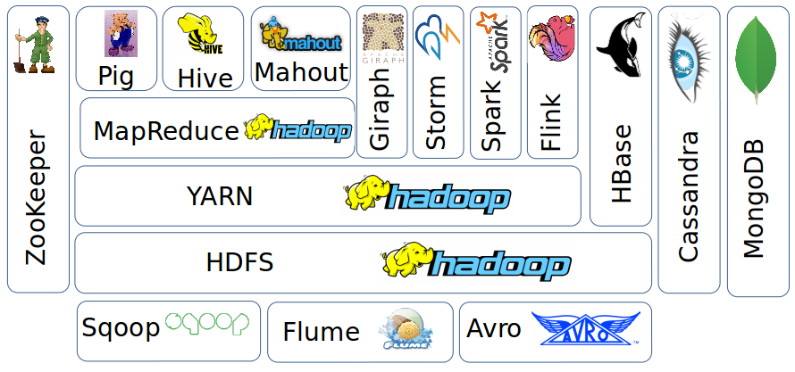
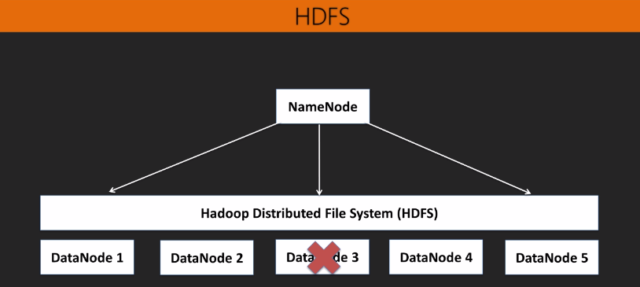
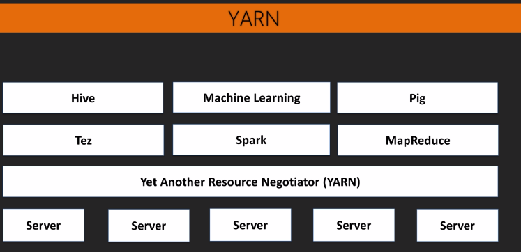
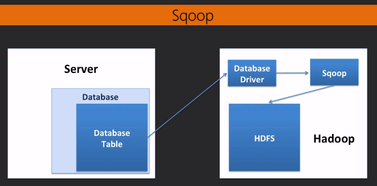
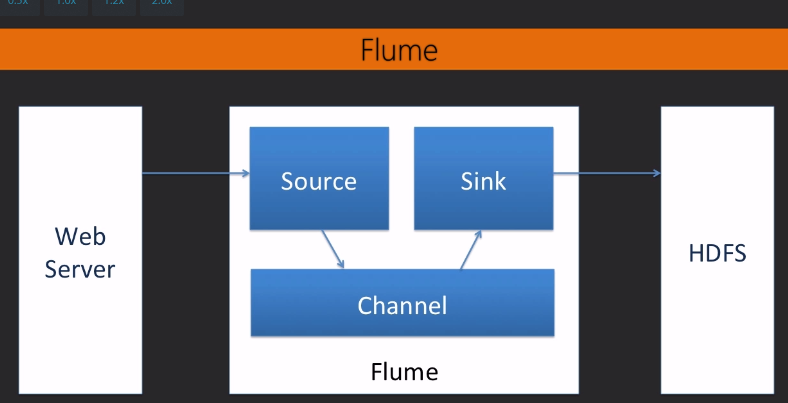
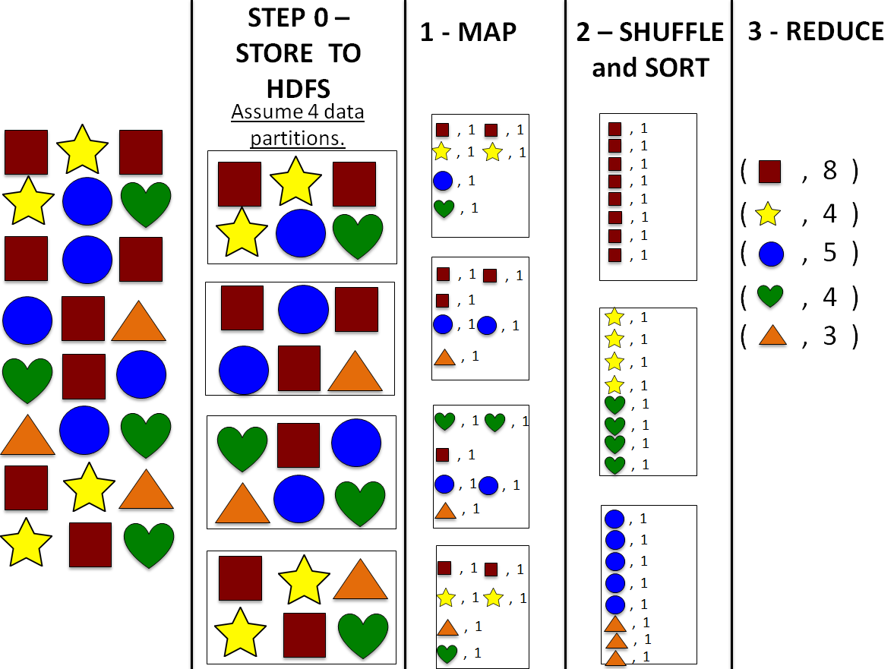

# Learning Note on Hadoop 2 

A combined note from on-line courses:

* **Big Data - Unlock Value in Massive Datasets** from University of California, San Diego [Coursera Specification](https://www.coursera.org/specializations/big-data)
* **Learning Hadoop 2** by Randal Scott King [Video Class from Packtpub](https://www.packtpub.com/mapt/video/big_data_and_business_intelligence/9781785888113)

## Table of Contents

<!-- START doctoc generated TOC please keep comment here to allow auto update -->
<!-- DON'T EDIT THIS SECTION, INSTEAD RE-RUN doctoc TO UPDATE -->


- [Section 1 Overview of Hadoop Ecosystem](#section-1-overview-of-hadoop-ecosystem)
  - [Section 1.1 Overview of HDFS and YARN](#section-11-overview-of-hdfs-and-yarn)
  - [Section 1.2 Overview of Sqoop and Flume](#section-12-overview-of-sqoop-and-flume)
  - [Section 1.3 Overview of MapReduce](#section-13-overview-of-mapreduce)
  - [Section 1.4 Overview of Pig](#section-14-overview-of-pig)
  - [Section 1.5 Overview of Hive](#section-15-overview-of-hive)
  - [Section 1.6 When to Reconsider Hadoop?](#section-16-when-to-reconsider-hadoop)
  - [Section 1.7 Cloud Computing - An Important Big Data Enabler](#section-17-cloud-computing---an-important-big-data-enabler)
  - [Summary](#summary)
- [Section 2 Installing and Hands-on Hadoop](#section-2-installing-and-hands-on-hadoop)
  - [Section 2.1 Downloading and Installing Cloudera Quickstart VM](#section-21-downloading-and-installing-cloudera-quickstart-vm)
  - [Section 2.2 Overview of Hue GUI](#section-22-overview-of-hue-gui)
  - [Section 2.3 Import and Export Data Manually](#section-23-import-and-export-data-manually)
  - [Section 2.4 Run MapReduce Example - WordCount](#section-24-run-mapreduce-example---wordcount)
  - [Section 2.5 Importing data from Database Using Sqoop](#section-25-importing-data-from-database-using-sqoop)
- [Next Sessions](#next-sessions)
  - [Using Flume to Import Streaming Data](#using-flume-to-import-streaming-data)
  - [Demonstrate Pig scripting](#demonstrate-pig-scripting)
  - [Using Hive](#using-hive)

<!-- END doctoc generated TOC please keep comment here to allow auto update -->

## Section 1 Overview of Hadoop Ecosystem



Major goals of Hadoop:

1. Enable Scalability
2. Handle Fault Tolerance
3. Optimized for a Variety Data Types
4. Facilitate a Shared Environment
5. Provide Value

### Section 1.1 Overview of HDFS and YARN

**Distributed computing**

* Problem: Big Data strains computing resources (CPU, storage)
* Solution: Distribute the load over many servers rather than one
* Yahoo! used the distributed computing model to develop Hadoop


**Hadoop Distributed File System(HDFS)**

* File system for Hadoop
* Spans all nodes in a cluster
* Stores data in 64M chunks on multiple servers

It is a foundation for Hadoop and provides scalable and reliable storage and fault tolerance. 

Data partitioning --> Scalability

Data replication --> Fault tolerance and Data locality

Two key components of HDFS:

1. NameNode for metadata, usualy one per cluster. The NameNode
	1. Coordinates operations
	2. Keeps track of file name, location in directory, etc. 
	3. Mapping of contents on DataNode
2. DataNodes for block storage, usually one per machine. Listens to NameNode for:
	1. block creation
	2. deletion
	3. replication - data locality and fault tolerance




**Yet Another Resource Negotiator(YARN)**

Flexible scheduling and resource management.

* Control access to cluster resources
* New in Hadoop 2
* Allows multiple compute engines to run (MapReduce, Spark, Tez, and so on)

Essential gears in YARN engine:

* Resource Manager(RM): RM + NM = Data Computation Framework
* Node Manager(NM): RM + NM = Data Computation Framework
* Application Master = personal negotiator
* Container = a machine





### Section 1.2 Overview of Sqoop and Flume

**How we get data into the HDFS**

**Sqoop(SQl on hadOOP)**

* Pulls data from relational databases (Oracle, PostgreSQL, and so on)
* Stores on HDFS or import directly to Hive
* Uses drivers that are not included


**Flume**

* Used to import streaming data(server log, tweets, and so on)
* Only a transport agent
* Buffered
* Three parts: Source, Channel, and Sink



### Section 1.3 Overview of MapReduce

MapReduce is a programming model that simplifies parallel computing.

1. Map --> Appply operations to all elements
2. Shuffle and sort
3. Reduce --> Sumamarize operation on elements


* Created by Yahoo! from a paper by Google
* Computation engine
* Coded in Java
* Two important functions: Map and Reduce

**How it works:**



**How create a MapReduce Program:**

* Create Java code
	* Import packages
	* Map: "Tokenize" words, create key/value pairs
	* Reduce: Sum instances of each word from all lines, create new key/value
	* Results in about 65 lines of code
* Compile and create a .jar from Java code
* Add .jar to Hadoop repository to use

**MapReduce is not good at:**

* Frequently changing data
* Dependent tasks
* Interactive analysis


### Section 1.4 Overview of Pig

* Developed by Yahoo! shortly after MapReduce
* Dataflow scripting language
* Builds MapReduce programs from scripts and translate into Java
* User Definable Functions(UDFs)


### Section 1.5 Overview of Hive

* Data warehousing solution for Hadoop
* Uses tables, just like traditional databases
* HiveQL - SQL-ish query language
* Schema on load
	* on traditional DB you have to define your schema before you load any data; Hive allows you define your schema after loading data
* Uses MapReduce as the engine

**Hive and Metadata**

* Metadata - data that describes data
* Derby 
* Derby versus MySQL


**Internal Versus External Tables**

* Internal Table(default)
	* Stores data in `user/hive/warehouse`
	* Not accessible to other applications
	* Dropping table delete data and metadata
	
* External Table
	* Data stays on HDFS
	* Accessible to other applications
	* Dropping table deletes only the metadata
	

**HiveQL versus SQL**

|HiveQL|SQL|
|---------|---------|
|CREATE DATABASE name;|CREATE DATABASE name;|
|SELECT * FROM table;|SELECT * FROM table;|
|SELECT COUNT(*) FROM table;|SELECT COUNT(*) FROM table;|
|Default Join is 'equi'|Default Join is 'inner'|
|Left Outer Join|Left Join|


### Section 1.6 When to Reconsider Hadoop?

When should use Hadoop?

* Future anticipated data growth
* Long term availability of data
* Many platforms over single data store
* High Volume
* High Variety

When should reconsider?

* Small Datasets
* Task level parallelism - Hadoop is good for data parallelism, which is the simultaneous execution of **the same function** on multiple nodes across the elements of a dataset. On the other hand, task parallelism is the simultaneous execution of **many different functions** on multiple nodes across the same or different data sets. 
* Advanced algorithms
* Replacement to your infrasturcture
* Random data access

### Section 1.7 Cloud Computing - An Important Big Data Enabler

Benefits of cloud:
* Pay as you go
* Quick implementation
* Deploy closer to your client
* Resource estimation solved
* Work on your domain expertise
* Instantly get different resources

Cloud service models:

* Infrastructure As a Service(IaaS) - Get the hardware only and you will install and maintain OS application software. For example, Amazon EC2
* Platform AS a Service (PaaS) - Get the computing environment, you can run application software. For example, Google App engine, Microsoft Azure
* Application AS a Service (SaaS) - Get full software on-demand, you can just focus on domain goals. For example, DropBox


Major factors: skills, demand, capital, security

### Summary

* HDFS and YARN - file system and resource scheduler
* Sqoop and Flume - automated data import/export
* MapReduce - original computational engine of Hadoop
* Pig- scripting language
* Hive - data warehousing
* Giraph - Specialized models for graph processing
* Storm, Spark and Flink are built for real-time and in-memory processing.
* HBase, Cassandra, and MongoDB are NoSQL for non-files, such as Key-values and sparse tables.
* ZooKeeper - Synchronization, Configuration, and Hight-availability

## Section 2 Installing and Hands-on Hadoop

### Section 2.1 Downloading and Installing Cloudera Quickstart VM

Use following instructions to download and install the Clourdera Quickstart VM with VirtualBox:

1. **Install VirtualBox.** If you don't have VirtualBox installed yet, you can go to [https://www.virtualbox.org/wiki/Downloads](https://www.virtualbox.org/wiki/Downloads) to download and install the latest version of VirtualBox for your computer.
2. **Download Cloudera Quickstart VM.** Go to [https://downloads.cloudera.com/demo_vm/virtualbox/cloudera-quickstart-vm-5.4.2-0-virtualbox.zip](https://downloads.cloudera.com/demo_vm/virtualbox/cloudera-quickstart-vm-5.4.2-0-virtualbox.zip) and specify VirtualBox as platform to download the latest version of Cloudera Quickstart VM V5.4.2. It might take some time to download, since the VM is over 4GB. After download, unzip the VM.
3. **Import Cloudera VM to VirtualBox**. Start VirtualBox, import VM by going to File --> Import Appliance, select the .ovf file from the folder where you unzipped the Cloudera VM and click Open. Follow the instructions prompted by the VirtualBox to finish importing process.
5. **Configure and Launch Cloudera VM**. When the importing is finished, the Cloudera Quickstart VM will appear on the left in the VirtualBox window. Select it and go to settings and pick General, make sure the OS type is Linux in the Basic tab and both Shared Clipboard and Drag and Drop are Bidirectional. Set enough memory in the System list. After all settings, click the Start button to launch the VM.

### Section 2.2 Overview of Hue GUI

Exploring the Hue, a graphic user interface for Hadoop, to get familiar with the interface.

* Navigate to the Hue page on top of the page, which takes to the home page for Hue.

* If you are first time to Hue, it will let you sign in to continue. Use default `cloudera` for both Username and Password.

* If you want to access to Hue remotely in a cluster, the port number is 8888 as shown in the address bar.

* Move to Step 4 GO and click on Hue Home link. It is the home page for Hue. On top there are various functional menus. For example, there is a Query Editors to create queries for Hive, Pig, etc. Click the Hive to demo the query interface.

* Move to the cloudera menu, where you can edit and manage user profiles. Click manage users to the user interface. Hadoop allows to link to LDAP server, which means you don't need to create user account for everyone. 

* Move to the file browser. It will show the file folder for the user we logged in with. To load some file, click the Upload option. There are Files and Zipped file options. Hadoop does not care much the types of file to upload, until it is not zipped.

### Section 2.3 Import and Export Data Manually 

* Importing data using Hue

	1. Open a browser and enter following link in address bar:[http://ocw.mit.edu/ans7870/6/6.006/s08/lecturenotes/files/t8.shakespeare.txt](Enter the following link in the browser: http://ocw.mit.edu/ans7870/6/6.006/s08/lecturenotes/files/t8.shakespeare.txt)
	2. Once the page is loaded, click on the Save Page from the Open menu button.
	3. Save the file with name `words.txt`. The file will be saved to /home/cloudera/Downloads
	4. Go the Hue --> File Browser --> Upload

* Importing data using CLI
	1. Open the command line. Make sure Downloads is the current directory, and type `wget https://raw.githubusercontent.com/stonefl/LearningHadoop2/master/Names.txt` to download another file.
	2. Run command `hdfs dfs -ls` or `hadoop fs -ls` to check if there is any files.
	3. Import a file to HDFS `hdfs dfs -copyFromLocal words.txt`
	4. Make a copy of file with HDFS `hdfs dfs -cp words.txt words2.txt`
	5. Export a file from HDFS `hdfs dfs -copyToLocal words2.txt`
	5. Delete a file in HDFS `hadoop fs -rm words2.txt`

* Differences of three commands
	* **hadoop fs {args}**
	* **hadoop dfs {args}** (deprecated)
	* **hdfs dfs {args}**
	
	**hadoop fs `<args`>**: `fs` relates to a generic file system which can point to any file systems like local, HDFS etc. So this can be used when you are dealing with different file systems such as Local FS, HFTP FS, S3 FS, and others

	**hadoop dfs `<args`>**:`dfs` is very specific to HDFS. would work for operation relates to HDFS. This has been deprecated and we should use `hdfs dfs` instead.

	**hdfs dfs `<args`>**: same as 2nd i.e would work for all the operations related to HDFS and is the recommended command instead of `hadoop dfs`

### Section 2.4 Run MapReduce Example - WordCount

* Use Hadoop Provided Example Jar
	1. Verify input file exists in HDFS `hdfs dfs -ls`
	2. Run MapReduce example Jar. If you are using cloudera-quickstart-vm-5.4: 
	
	  `hadoop jar /usr/jars/haoop-examples.jar`

	  `hadoop jar /usr/jars/haoop-examples.jar wordcount`

	  `hadoop jar /usr/jars/haoop-examples.jar wordcount words.txt output1`
      
	   if you are using newer version, such cloudera-quickstart-vm-5.8:

       `hadoop jar /usr/lib/hadoop-mapreduce/hadoop-mapreduce-examples.jar wordcount words.txt output1`
    3. Check the output folder `hadoop fs -ls output1`
    4. Copy result to local file system `haddop fs -copyToLocal output1/part-r-00000 result1.txt`
    5. View local result `more result1.txt`

* Use Own-built Jar 
	1. Open Eclipse and build a new Java project with the name `WordCountDemo`
	2. Add external jars from both `/usr/lib/hadoop` and `/usr/lib/hadoop/client` to the java build path  
	3. Add a new class named `WordCount` and copy the source code from GitHub to it
	4. Export the project to a .jar file and save it to `home/cloudera`
	5. Add the input file to the HDFS
	6. Run `hadoop jar /home/cloudera/WordCount.jar WordCount Names.txt output2`
	7. Check the output folder `hadoop fs -ls output2`
    4. Copy result to local file system `haddop fs -copyToLocal output2/part-r-00000 result2.txt`
    5. View local result `more result2.txt`


### Section 2.5 Importing data from Database Using Sqoop

* Create a database in MySQL and load data to it


	1. Download the _*SqoopExample.zip*_ file from [Learning Hadoop 2's GitHub repository](https://github.com/stonefl/LearningHadoop2). and unzip it.
	
	2. From the terminal run `sudo service mysqld status` to check if MySQL server is running. `sudo service mysqld start` and `sudo service mysql stop` are two useful commands to start and stop MySQL server, respectively. 
	
	3. Use command `mysql -u root -p` to login.
	
	4. Use `SHOW DATABASES;` to check existing databases. You can see all databases set up with cloudera image. Note: don't forget the semicolon at the end.
	
	5. Use `CREATE DATABASE fdxcorp;` to create a new database named with _fdxcorp_ for us.

	6. Use `USE fdxcorp;` to pick the database just built.

	7. Use following query to build a table named with _Customers_:

	```
		CREATE TABLE Customers
		(AccountNo TEXT, AccountName Text, Address TEXT, City TEXT, State TEXT, ZIP TEXT);
	```
	8. Use `DESCRIBE Customers;` to check the table just build.

	9. Use following query to load the _Customers.csv_ file to the _Customers_ table:

	```
		LOAD DATA LOCAL INFILE
		'/home/cloudera/Downloads/SqoopExample/Customers.csv'
		INTO TABLE Customers
		FIELDS TERMINATED BY ','
		LINES TERMINATED BY '/r';
	```

	10. Use `SELECT * FROM Customers` to make sure data has been loaded correctly.

	11. Type `exit` to exit MySQL.


* Using Sqoop command line to import data from the MySQL database to HDFS.

Use Sqoop query blew to import the _Customer_ table from MySQL to HDFS, or you can just run the `sqoopImport.sh` in the _SqoopExample_ directory.

```
sqoop import \
--connect jdbc:mysql://127.0.0.1:3306/fdxcorp \
--table Customers \
--username root -P \
--direct -m 1;

```

## Next Sessions

### Using Flume to Import Streaming Data
* Modify the Flume Agent configuration file
* Create a text file in the local spooling directory and use Flume to import it to HDFS 

### Demonstrate Pig scripting

* Coding the same word counting program, but this time in Pig.
	* Open the Pig Script Editor in Hue and build our script
	* Save the script for future use and run it
	* Check the progress of the job in Hue and view the result 
	
* Use Pig to perform common Extract, Transform, and Load functions on data.
	* Filter out certain data from a dataset and save the result
	* Append one dataset to another in an identical format using Union
	* Join one dataset to another using a common column in each 

* Use predefined code called User Defined Functions (UDFs) in Pig scripts.
	* Identify whether two UDF repositories (Piggybank and DataFu) are installed
	* Register the Stats UDF and define a Quartile function to use it
	* Write the script and run the code, resulting in a document that shows the minimum, median, and max values for Quantity in our data 

### Using Hive


